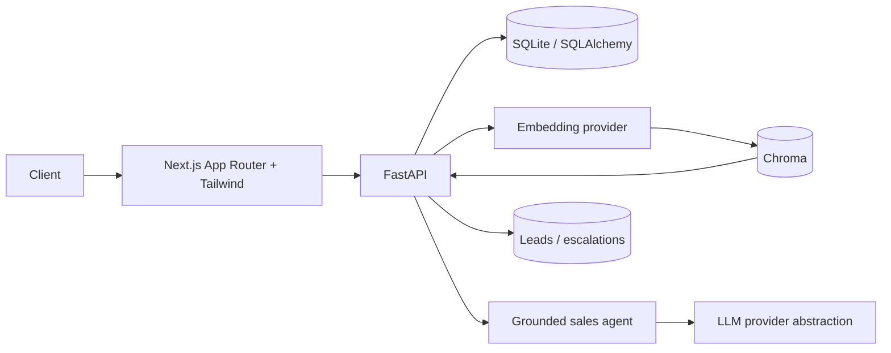

# Architecture

FastAPI routes use async SQLAlchemy repositories. Embeddings are supplied by a deterministic
provider for offline tests or an OpenAI-compatible provider in production. Chroma stores
documents, embeddings, stable `property_id` IDs, and searchable metadata.
Chat persists conversations, messages, and retrieval traces. Responses are validated against
retrieved context before being returned.

The Phase 3 frontend is a deliberately thin client: `frontend/lib/api.ts` owns HTTP
communication and `frontend/lib/types.ts` mirrors the public response contracts. App Router
pages compose accessible loading, error, and empty states without duplicating backend logic.
CORS is restricted to `FRONTEND_URL`; production deployments should set that to the deployed UI.
